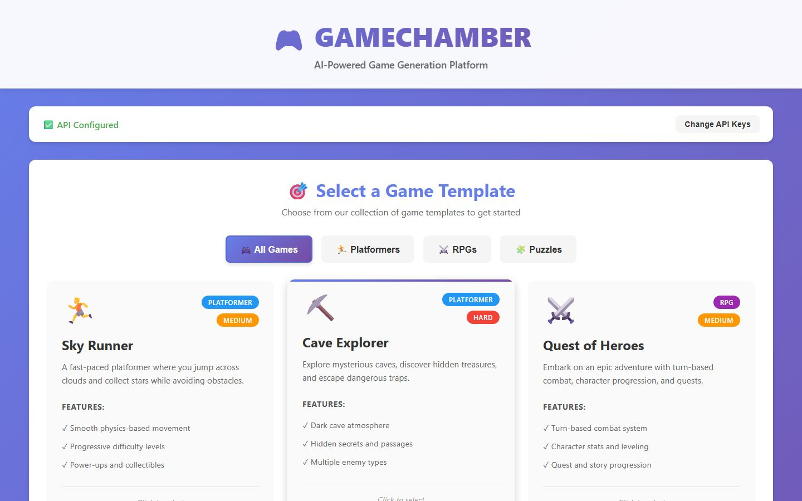
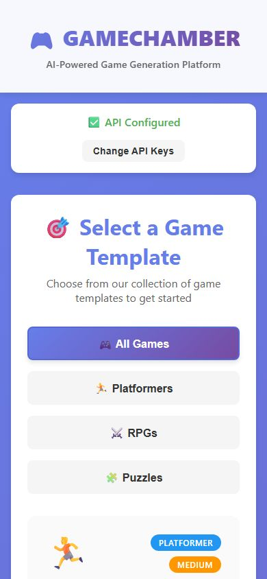

# GameChamber

Plataforma web que genera juegos completos y jugables con inteligencia artificial. Eliges una plantilla (plataformas, RPG o rompecabezas), la IA diseña la idea, las mecánicas y el código, y descargas el juego listo para abrir en el navegador. Es para quien quiere prototipar juegos sin escribir todo desde cero.

| Escritorio | Móvil |
| --- | --- |
|  |  |

## Qué hace

- Catálogo de 7 plantillas: Sky Runner y Cave Explorer (plataformas), Quest of Heroes y Dungeon Master (RPG), Block Master, Mind Bender y Maze Runner (rompecabezas).
- Usa la API de Gemini como opción principal y la de Claude como respaldo.
- Muestra el avance en tiempo real por etapas: inicialización, concepto, mecánicas, recursos, código e integración.
- Descarga los archivos del juego: `index.html`, `style.css`, `game.js` y un `README.md`.
- Las llaves se guardan solo en memoria durante la sesión.

## Tecnologías

React 18, Vite, Express, Axios, Google Generative AI SDK, API de Claude.

## Cómo correrlo

Necesitas Node.js 16 o más nuevo y una llave de Gemini o de Claude.

```bash
npm install
cp .env.example .env
npm run dev
```

Variables en `.env`: `GEMINI_API_KEY`, `CLAUDE_API_KEY` (opcional) y `PORT` (3001 por defecto). También puedes escribir las llaves en la pantalla inicial de la app.

El servidor queda en `http://localhost:3001` y la interfaz en `http://localhost:5173`.

## API

- `POST /api/setup` configura las llaves.
- `POST /api/generate-game` inicia la generación.
- `GET /api/status/:jobId` consulta el avance de un trabajo.
- `GET /health` revisa que el servidor esté activo.

## Licencia

MIT, según `package.json`.
